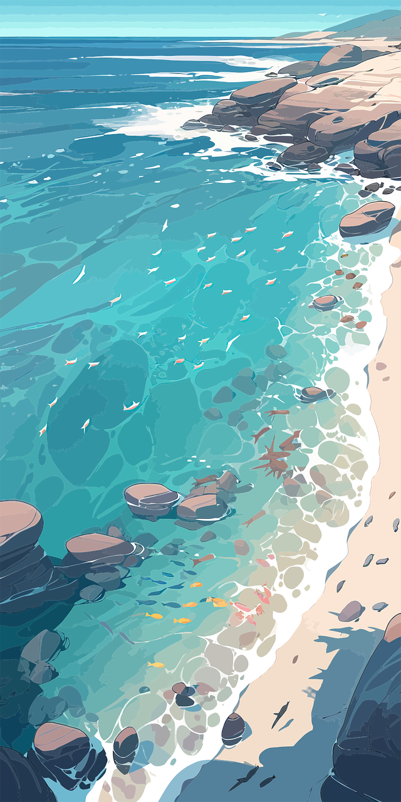

<table>
  <tr>
    <td>
      
    </td>
    <td>
      

        <h1>Hi there! I'm Veruska 🌊</h1>
        <h3>🤿 Software Developer | QA Specialist | Web Developer</h3>
         
        
I love creating cool stuff and learning new technologies along the way. 
        Right now, I'm focused on <strong>Spring Boot (Java)</strong> and learning more about <strong>Kotlin</strong> for mobile apps.

  <h3>🌴 About Me</h3>
  
I work as a QA Engineer, but I'm passionate about development. And I’m always working on improving my skills in backend, frontend, and mobile development. Always learning something new!

  <h3>⚓ Stack</h3>
  

    <strong>🦭 Languages</strong>: Java, Python, C, Scala, JavaScript, Bash Script
     
    <strong>🐙 Frameworks</strong>: Spring Boot <i>(Java)</i>, Fast API <i>(Python)</i>, MERN Stack <i>(Javascript)</i>, Robot Framework <i>(Python)</i>, Selenium <i>(Python)</i>
     
    <strong>🐬 Tools</strong>: Git, Docker, GitLab CI/CD, Postman, Jenkins
  

  

  <h3>🐚 Let's Connect</h3>
  
<strong><a href="https://linkedin.com/in/veruska-diniz">LinkedIn</a></strong> | <strong><a href="mailto:veruskalima138@gmail.com">Email</a></strong>

  

  

  </td>
  </tr>
</table>
